# IDLファイル

* [ExtendedDataTypes.idl](http://svn.openrtm.org/OpenRTM-aist/trunk/OpenRTM-aist/src/lib/rtm/idl/ExtendedDataTypes.idl)

# 目次

* [TimedRGBColour](#timedrgbcolour)
* [TimedPoint2D](#timedpoint2d)
* [TimedVector2D](#timedvector2d)
* [TimedPose2D](#timedpose2d)
* [TimedVelocity2D](#timedvelocity2d)
* [TimedAcceleration2D](#timedacceleration2d)
* [TimedPoseVel2D](#timedposeVel2d)
* [TimedSize2D](#timedsize2d)
* [TimedGeometry2D](#timedgeometry2d)
* [TimedCovariance2D](#timedcovariance2d)
* [TimedPointCovariance2D](#timedpointcovariance2d)
* [TimedCarlike](#timedcarlike)
* [TimedSpeedHeading2D](#timedspeedheading2d)
* [TimedPoint3D](#timedpoint3d)
* [TimedVector3D](#timedvector3d)
* [TimedOrientation3D](#timedorientation3d)
* [TimedPose3D](#timedpose3d)
* [TimedVelocity3D](#timedvelocity3d)
* [TimedAngularVelocity3D](#timedangularvelocity3d)
* [TimedAcceleration3D](#timedacceleration3d)
* [TimedAngularAcceleration3D](#timedangularacceleration3d)
* [TimedPoseVel3D](#timedposevel3d)
* [TimedSize3D](#timedsize3d)
* [TimedGeometry3D](#timedgeometry3d)
* [TimedCovariance3D](#timedcovariance3d)
* [TimedSpeedHeading3D](#timedspeedheading3d)
* [TimedOAP](#timedoap)
* [TimedQuaternion](#timedquaternion)

## TimedRGBColour

色を表現するためのデータ型。
RGBの各値を格納する。

|名前|型|説明|単位|
|---|---|---|---|
|tm|[RTC::Time](基本データ型#time)|タイムスタンプ||
|data|[RTC::RGBColour](#rgbcolour)|データ||

### RGBColour

RGBは`0.0 < data < 1.0`の範囲で設定する。

|名前|型|説明|単位|
|---|---|---|---|
|r|double|赤||
|g|double|緑||
|b|double|青||

## TimedPoint2D

2次元での位置座標を表現するデータ型。

|名前|型|説明|単位|
|---|---|---|---|
|tm|[RTC::Time](基本データ型#time)|タイムスタンプ||
|data|[RTC::Point2D](#point2d)|データ||

### Point2D

|名前|型|説明|単位|
|---|---|---|---|
|x|double|位置(X)|m|
|y|double|位置(Y)|m|

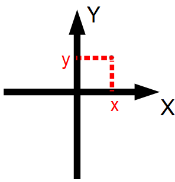

## TimedVector2D

2次元ベクトルを表現するデータ型。

|名前|型|説明|単位|
|---|---|---|---|
|tm|[RTC::Time](基本データ型#time)|タイムスタンプ||
|data|[RTC::Vector2D](#vector2d)|データ||

### Vector2D

|名前|型|説明|単位|
|---|---|---|---|
|x|double|ベクトル成分(X)|m|
|y|double|ベクトル成分(Y)|m|

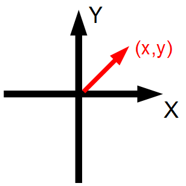

## TimedPose2D

2次元の位置姿勢を表現するデータ型。

|名前|型|説明|単位|
|---|---|---|---|
|tm|[RTC::Time](基本データ型#time)|タイムスタンプ||
|data|[RTC::Pose2D](#pose2d)|データ||

### Pose2D

|名前|型|説明|単位|
|---|---|---|---|
|position|[RTC::Point2D](#point2d)|位置||
|heading|double|方向|rad|

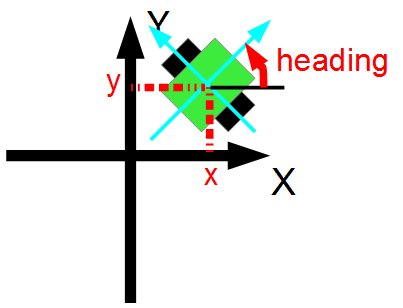

## TimedVelocity2D

|名前|型|説明|単位|
|---|---|---|---|
|tm|[RTC::Time](基本データ型#time)|タイムスタンプ||
|data|[RTC::Velocity2D](#velocity2d)|データ||

### Velocity2D

RGBは`0.0<data<1.0`の範囲で設定する。

|名前|型|説明|単位|
|---|---|---|---|
|vx|double|並進速度(X)|m/s|
|vy|double|並進速度(Y)|m/s|
|va|double|回転速度|rad/s|

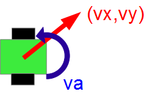

## TimedAcceleration2D

2次元の加速度を表現するデータ型。

|名前|型|説明|単位|
|---|---|---|---|
|tm|[RTC::Time](基本データ型#time)|タイムスタンプ||
|data|[RTC::Acceleration2D](#acceleration2d)|データ||

### Acceleration2D

|名前|型|説明|単位|
|---|---|---|---|
|ax|double|並進加速度(X)|m/s^2|
|ay|double|並進加速度(Y)|m/s^2|

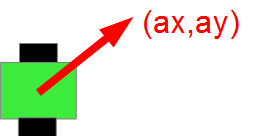

## TimedPoseVel2D

2次元の位置、速度を表現するデータ型。

|名前|型|説明|単位|
|---|---|---|---|
|tm|[RTC::Time](基本データ型#time)|タイムスタンプ||
|data|[RTC::PoseVel2D](#posevel2d)|データ||

### PoseVel2D

|名前|型|説明|単位|
|---|---|---|---|
|pose|[RTC::Pose2D](#pose2d)|位置||
|velocities|[RTC::Velocity2D](#velocity2d)|速度||

## TimedSize2D

2次元の形状を表現するデータ型。

|名前|型|説明|単位|
|---|---|---|---|
|tm|[RTC::Time](基本データ型#time)|タイムスタンプ||
|data|[RTC::Size2D](#size2d)|データ||

### Size2D

|名前|型|説明|単位|
|---|---|---|---|
|l|double|長さ|m|
|w|double|幅|m|

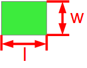

## TimedGeometry2D

2次元のジオメトリ(形状・位置)を表現するデータ型。

|名前|型|説明|単位|
|---|---|---|---|
|tm|[RTC::Time](基本データ型#time)|タイムスタンプ||
|data|[RTC::Geometry2D](#geometry2d)|データ||

### Geometry2D

|名前|型|説明|単位|
|---|---|---|---|
|pose|[RTC::Pose2D](#pose2d)|位置||
|size|[RTC::Size2D](#size2d)|形状||

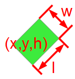

## TimedCovariance2D

2次元位置姿勢の共分散行列。

|名前|型|説明|単位|
|---|---|---|---|
|tm|[RTC::Time](基本データ型#time)|タイムスタンプ||
|data|[RTC::Covariance2D](#covariance2d)|データ||

### Covariance2D

|名前|型|説明|単位|
|---|---|---|---|
|xx|double|1行1列目|m^2|
|xy|double|1行2列目、2行1列目|m^2|
|xt|double|1行3列目、3行1列目|m・rad|
|yy|double|2行2列目|m^2|
|yt|double|2行3列目、3行2列目|m・rad|
|tt|double|3行3列目|m・rad|

## TimedPointCovariance2D

2次元位置の共分散行列。

|名前|型|説明|単位|
|---|---|---|---|
|tm|[RTC::Time](基本データ型#time)|タイムスタンプ||
|data|[RTC::PointCovariance2D](#pointcovariance2d)|データ||

### PointCovariance2D

|名前|型|説明|単位|
|---|---|---|---|
|xx|double|1行1列目|m^2|
|xy|double|1行2列目、2行1列目|m^2|
|yy|double|2行2列目|m^2|

## TimedCarlike

車のような駆動輪とステアリングを有する移動ロボットを表現するデータ型。

|名前|型|説明|単位|
|---|---|---|---|
|tm|[RTC::Time](基本データ型#time)|タイムスタンプ||
|data|[RTC::Carlike](#carlike)|データ||

### Carlike

|名前|型|説明|単位|
|---|---|---|---|
|speed|double|速度|m/s|
|steeringAngle|double|ステアリング角度|rad|

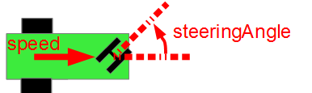

## TimedSpeedHeading2D

2次元で推進したい方向と速度を入力する移動ロボットを表現するデータ型。

|名前|型|説明|単位|
|---|---|---|---|
|tm|[RTC::Time](基本データ型#time)|タイムスタンプ||
|data|[RTC::SpeedHeading2D](#speedheading2d)|データ||

### SpeedHeading2D

|名前|型|説明|単位|
|---|---|---|---|
|speed|double|速度|m/s|
|heading|double|推進方向|rad|

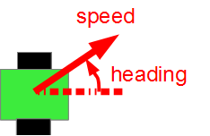

## TimedPoint3D

3次元の位置を表現するデータ型。

|名前|型|説明|単位|
|---|---|---|---|
|tm|[RTC::Time](基本データ型 #time)|タイムスタンプ||
|data|[RTC::Point3D](#point3d)|データ||

### Point3D

|名前|型|説明|単位|
|---|---|---|---|
|x|double|位置(X)|m|
|y|double|位置(Y)|m|
|z|double|位置(Z)|m|

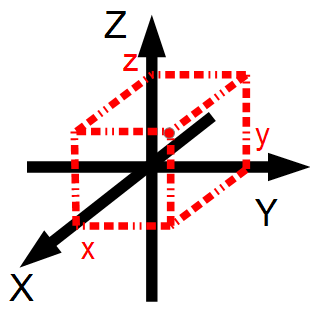

## TimedVector3D

3次元ベクトルを表現するデータ型。

|名前|型|説明|単位|
|---|---|---|---|
|tm|[RTC::Time](基本データ型#time)|タイムスタンプ||
|data|[RTC::Vector3D](#vector3d)|データ||

### Vector3D

|名前|型|説明|単位|
|---|---|---|---|
|x|double|速度(X)|m/s|
|y|double|速度(Y)|m/s|
|z|double|速度(Z)|m/s|

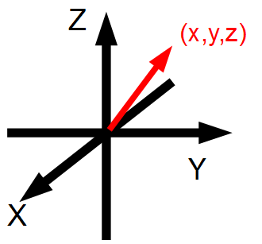

## TimedOrientation3D

3次元の姿勢を表現するデータ型。

|名前|型|説明|単位|
|---|---|---|---|
|tm|[RTC::Time](基本データ型#time)|タイムスタンプ||
|data|[RTC::Orientation3D](#orientation3d)|データ||

### Orientation3D

|名前|型|説明|単位|
|---|---|---|---|
|r|double|ロール角|rad|
|p|double|ピッチ角|rad|
|y|double|ヨー角|rad|

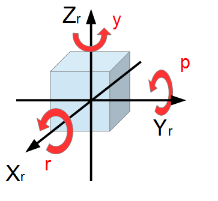

## TimedPose3D

3次元の位置、姿勢を表現するデータ型。

|名前|型|説明|単位|
|---|---|---|---|
|tm|[RTC::Time](基本データ型#time)|タイムスタンプ||
|data|[RTC::Pose3D](#pose3d)|データ||

### Pose3D

|名前|型|説明|単位|
|---|---|---|---|
|position|[RTC::Point3D](#point3d)|位置||
|orientation|[RTC::Orientation3D](#orientation3d)|姿勢||

## TimedVelocity3D

3次元の速度、角速度を表現するデータ型。

|名前|型|説明|単位|
|---|---|---|---|
|tm|[RTC::Time](基本データ型#time)|タイムスタンプ||
|data|[RTC::Velocity3D](#velocity3d)|データ||

### Velocity3D

|名前|型|説明|単位|
|---|---|---|---|
|vx|double|並進速度(X)|m/s|
|vy|double|並進速度(Y)|m/s|
|vz|double|並進速度(Z)|m/s|
|vr|double|角速度(ロール)|rad/s|
|vp|double|角速度(ピッチ)|rad/s|
|va|double|角速度(ヨー)|rad/s|

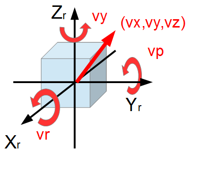

## TimedAngularVelocity3D

3次元の角速度を表現するデータ型。

|名前|型|説明|単位|
|---|---|---|---|
|tm|[RTC::Time](基本データ型#time)|タイムスタンプ||
|data|[RTC::AngularVelocity3D](#angularvelocity3d)|データ||

### AngularVelocity3D

|名前|型|説明|単位|
|---|---|---|---|
|avx|double|角速度(X)|rad/s|
|avy|double|角速度(Y)|rad/s|
|avz|double|角速度(Z)|rad/s|

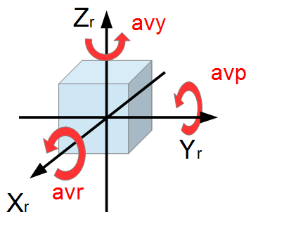

## TimedAcceleration3D

3次元の加速度を表現するデータ型。

|名前|型|説明|単位|
|---|---|---|---|
|tm|[RTC::Time](基本データ型#time)|タイムスタンプ||
|data|[RTC::Acceleration3D](#acceleration3d)|データ||

### Acceleration3D

|名前|型|説明|単位|
|---|---|---|---|
|ax|double|加速度(X)|m/s^2|
|ay|double|加速度(Y)|m/s^2|
|az|double|加速度(Z)|m/s^2|

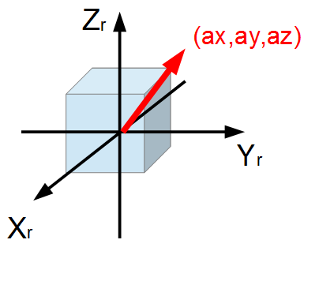

## TimedAngularAcceleration3D

3次元の角加速度を表現するデータ型。

|名前|型|説明|単位|
|---|---|---|---|
|tm|[RTC::Time](基本データ型#time)|タイムスタンプ||
|data|[RTC::AngularAcceleration3D](#angularacceleration3d)|データ||

### AngularAcceleration3D

|名前|型|説明|単位|
|---|---|---|---|
|aax|double|角加速度(X)|rad/s^2|
|aay|double|角加速度(Y)|rad/s^2|
|aaz|double|角加速度(Z)|rad/s^2|

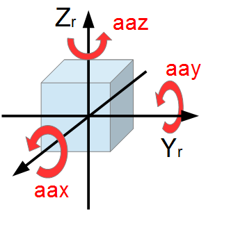

## TimedPoseVel3D

3次元の位置、速度を表現するデータ型。

|名前|型|説明|単位|
|---|---|---|---|
|tm|[RTC::Time](基本データ型#time)|タイムスタンプ||
|data|[RTC::PoseVel3D](#posevel3d)|データ||

### PoseVel3D

|名前|型|説明|単位|
|---|---|---|---|
|pose|[RTC::Pose3D](#pose3d)|位置||
|velocities|[RTC::Velocity3D](#velocity3d)|速度||

## TimedSize3D

3次元で形状を表現するデータ型。

|名前|型|説明|単位|
|---|---|---|---|
|tm|[RTC::Time](基本データ型#time)|タイムスタンプ||
|data|[RTC::Size3D](#size3d)|データ||

### Size3D

|名前|型|説明|単位|
|---|---|---|---|
|l|double|長さ|m|
|w|double|幅|m|
|h|double|高さ|m|

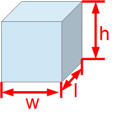

## TimedGeometry3D

3次元のジオメトリ(形状、位置)を表現するデータ型。

|名前|型|説明|単位|
|---|---|---|---|
|tm|[RTC::Time](基本データ型#time)|タイムスタンプ||
|data|[RTC::Geometry3D](#geometry3d)|データ||

### Geometry3D

|名前|型|説明|単位|
|---|---|---|---|
|pose|[RTC::Pose3D](#pose3d)|位置||
|size|[RTC::Size3D](#size3d)|形状||

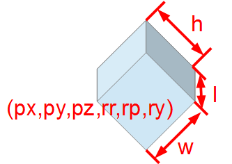

## TimedCovariance3D

3次元位置姿勢の共分散行列。

|名前|型|説明|単位|
|---|---|---|---|
|tm|[RTC::Time](基本データ型#time)|タイムスタンプ||
|data|[RTC::Covariance3D](#covariance3d)|データ||

### Covariance3D

|名前|型|説明|単位|
|---|---|---|---|
|xx|double|1行1列目|m^2|
|xy|double|1行2列目、2行1列目|m^2|
|xz|double|1行3列目、3行1列目|m^2|
|xr|double|1行4列目、4行1列目|m・rad|
|xp|double|1行5列目、5行1列目|m・rad|
|xa|double|1行6列目、6行1列目|m・rad|
|yy|double|2行2列目|m^2|
|yz|double|2行3列目、3行2列目|m^2|
|yr|double|2行4列目、4行2列目|m・rad|
|yp|double|2行5列目、5行2列目|m・rad|
|ya|double|2行6列目、6行2列目|m・rad|
|zz|double|3行3列目|m^2|
|zr|double|3行4列目、4行3列目|m・rad|
|zp|double|3行5列目、5行3列目|m・rad|
|za|double|3行6列目、6行3列目|m・rad|
|rr|double|4行4列目|rad^2|
|rp|double|4行5列目、5行4列目|rad^2|
|ra|double|4行6列目、6行4列目|rad^2|
|pp|double|5行5列目|rad^2|
|pa|double|5行6列目、6行5列目|rad^2|
|aa|double|6行6列目|rad^2|

## TimedSpeedHeading3D

3次元で推進したい方向と速度を入力する移動ロボットを表現するデータ型。

|名前|型|説明|単位|
|---|---|---|---|
|tm|[RTC::Time](基本データ型#time)|タイムスタンプ||
|data|[RTC::SpeedHeading3D](#speedheading3d)|データ||

### SpeedHeading3D

|名前|型|説明|単位|
|---|---|---|---|
|speed|double|速度|m/s|
|direction|[RTC::Orientation3D](#orientation3d)|方向||

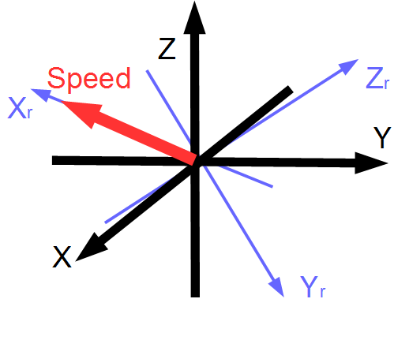

## TimedOAP

3次元での位置姿勢を3つのベクトルで表現するデータ型。

|名前|型|説明|単位|
|---|---|---|---|
|tm|[RTC::Time](基本データ型#time)|タイムスタンプ||
|data|[RTC::OAP](#oap)|データ||

### OAP

|名前|型|説明|単位|
|---|---|---|---|
|orientation|[RTC::Vector3D](#vector3d)|姿勢ベクトル||
|approach|[RTC::Vector3D](#vector3d)|接近方向ベクトル||
|position|[RTC::Vector3D](#vector3d)|位置ベクトル||

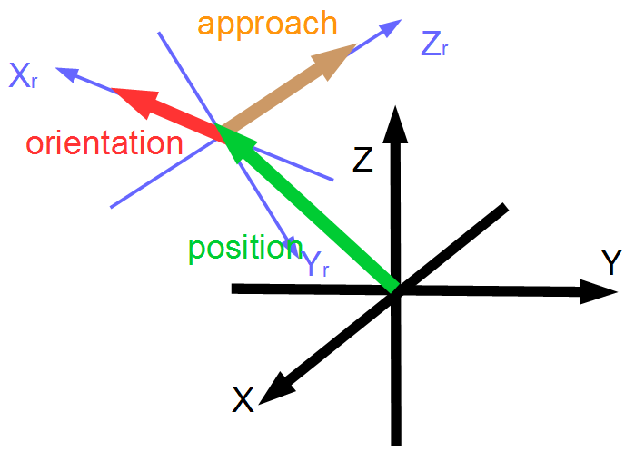

## TimedQuaternion

四元数を表現するデータ型。

|名前|型|説明|単位|
|---|---|---|---|
|tm|[RTC::Time](基本データ型#time)|タイムスタンプ||
|data|[RTC::Quaternion](#quaternion)|データ||

### Quaternion

|名前|型|説明|単位|
|---|---|---|---|
|x|double|虚部||
|y|double|虚部||
|z|double|虚部||
|w|double|実部||
