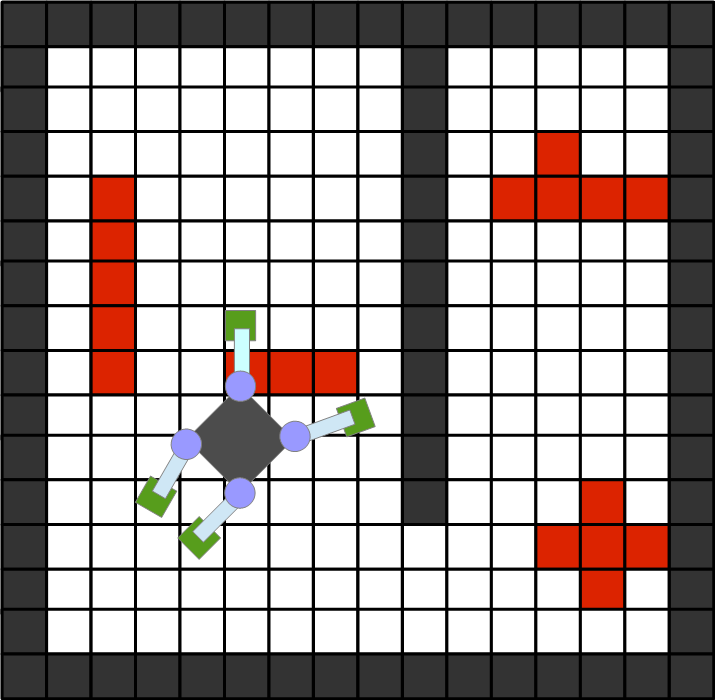

# 目次

* [駆動サーボ](#駆動サーボ)
* [平面移動ロボット](#平面移動ロボット)
* [不整地移動ロボット](#不整地移動ロボット)
* [画像処理](#画像処理)
* [距離センサ](#距離センサ)
* [GPS](#GPS)

## 駆動サーボ

データポートではなく、[OpenHRP::ServoControllerService](https://github.com/fkanehiro/hrpsys-base/blob/master/idl/ServoControllerService.idl)の利用を推奨しています。

データポートを使う場合は以下のデータ型推奨。

* [JARA_ARM::TimedJointPos](RobotArm#timedjointpos)
* [RTC::ActArrayActuatorPos](RobotInterface#actarrayactuatorpos)
* [RTC::ActArrayActuatorSpeed](RobotInterface#actarrayactuatorspeed)
* [RTC::ActArrayActuatorCurrent](RobotInterface#actarrayactuatorcurrent)

ただ、これらのデータ型を使ったRTCは少ないため最悪[RTC::TimedDoubleSeq](BasicDataTypes#timeddoubleseq)型でも可。
全く共通化できていない。

## 平面移動ロボット

[RTC::TimedVelocity2D](ExtendDataTypes#timedvelocity2d)を推奨。
[RTC::TimedSpeedHeading2D](ExtendDataTypes#timedspeedheading2d)は使いどころが分からない。
[RTC::TimedCarlike](ExtendDataTypes#timedcarlike)はどちらかと言えば[ステアリングコントローラー](http://www.openrtm.org/openrtm/ja/project/contest2015_16)のような入力デバイスで使うものだと思います。

## 不整地移動ロボット

データの表現はかなり難しい。共通化の必要あり。
例えば多足歩行ロボットで障害物を跨いで回避するのであれば[RTC::TimedVelocity2D](ExtendDataTypes#timedvelocity2d)で適用可能かもしれません。この場合は高さ情報を含む地図情報が必要になるのでまた違う問題が出てきそうです。

ここにロボットの姿勢が関わってくると[RTC::TimedVelocity3D](ExtendDataTypes#timedvelocity3d)で操作するのが適当だと言う事にはなるのですが、ドローンならともかく歩行ロボットは3次元空間を自由な方向へ移動できるわけではないので微妙です。

## 画像処理

今後は[Img::TimedCameraImage](ImageProcessing#timedcameraimage)を使う事を推奨。
ただこのデータ型を使ったRTCが無いため、[RTC::CameraImage](RobotInterface#cameraimage)を使わざる得ない。

## 距離センサ

[RTC::RangeData](RobotInterface#rangedata)を使う事を強く推奨。
ただ測域センサではなくただの超音波距離センサ等にこのデータ型を使うと分かりづらくなるのでやめた方がいいかもしれない。

## GPS

[RTC::GPSData](RobotInterface#gpsdata)を使う事を強く推奨。
