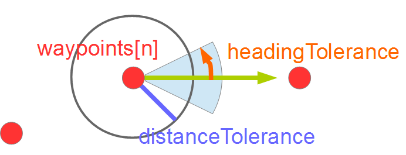
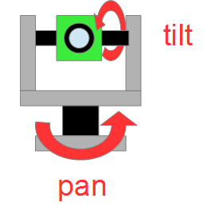
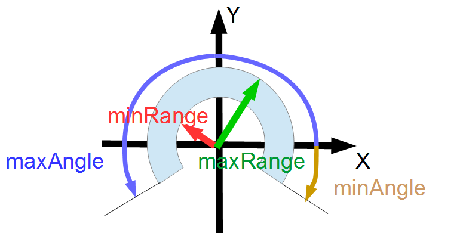

# IDLファイル
- http://svn.openrtm.org/OpenRTM-aist/trunk/OpenRTM-aist/src/lib/rtm/idl/InterfaceDataTypes.idl

# 目次
- [ActArrayActuatorPos](#actarrayactuatorpos)
- [ActArrayActuatorSpeed](#actarrayactuatorspeed)
- [ActArrayActuatorCurrent](#actArrayactuatorcurrent)
- [ActArrayState](#actarraystate)
- [CameraImage](#cameraimage)
- [Fiducials](#fiducials)
- [GPSData](#gpsdata)
- [GripperState](#gripperstate)
- [INSData](#insdata)
- [LimbState](#limbstate)
- [Hypotheses2D](#hypotheses2d)
- [Hypotheses3D](#hypotheses3d)
- [Features](#features)
- [MultiCameraImages](#multicameraimages)
- [Path2D](#path2d)
- [Path3D](#path3d)
- [PointCloud](#pointcloud)
- [PanTiltAngles](#pantiltangles)
- [PanTiltState](#pantiltstate)
- [RangeData](#rangedata)
- [IntensityData](#intensitydata)

## ActArrayActuatorPos
単一のアクチュエータの位置を格納するデータ型。  

|名前|型|説明|単位|
|---|---|---|---|
|tm|[RTC::Time](基本データ型#time)|タイムスタンプ||
|index|unsigned short|アクチュエータの番号||
|position|double|アクチュエータの位置|m or rad|

## ActArrayActuatorSpeed
単一のアクチュエータの速度を格納するデータ型。  

|名前|型|説明|単位|
|---|---|---|---|
|tm|[RTC::Time](基本データ型#time)|タイムスタンプ||
|index|unsigned short|アクチュエータの番号||
|speed|double|アクチュエータの速度|m or rad|

## ActArrayActuatorCurrent
単一のアクチュエータの電流値を格納するデータ型。  

|名前|型|説明|単位|
|---|---|---|---|
|tm|[RTC::Time](基本データ型#time)|タイムスタンプ||
|index|unsigned short|アクチュエータの番号||
|current|double|アクチュエータの電流値|A|

## ActArrayState
複数のアクチュエータの情報を格納するデータ型。  

|名前|型|説明|単位|
|---|---|---|---|
|tm|[RTC::Time](基本データ型#time)|タイムスタンプ||
|actuators|[RTC::ActuatorList](#actuatorlist)|アクチュエータのリスト||

### ActuatorList
[RTC::Actuator](#actuator)型の配列として定義。  

### Actuator
単一のアクチュエータの情報を格納する。  

|名前|型|説明|単位|
|---|---|---|---|
|position|double|現在の位置|m or rad|
|speed|double|現在の速度|m/s or rad/s|
|accel|double|現在の加速度|m/s^2 or rad/s^2|
|current|double|現在の電流値|A|
|status|[RTC::ActArrayActuatorStatus](#actArrayactuatorstatus)|状態||

### ActArrayActuatorStatus
以下の値を列挙。  
アクチュエータの状態を表現。  

|名前|説明|
|---|---|
|ACTUATOR_STATUS_IDLE|停止|
|ACTUATOR_STATUS_MOVING|動作中|
|ACTUATOR_STATUS_BRAKED|故障|
|ACTUATOR_STATUS_STALLED|脱調|

### ActArrayGeometry
複数のアクチュエータのジオメトリ情報を格納  

|名前|型|説明|単位|
|---|---|---|---|
|arrayGeometry|[RTC::Geometry3D](拡張データ型#geometry3d)|ジオメトリ情報||
|actuatorGeometry|[RTC::ActArrayActuatorGeometryList](拡張データ型#actarrayactuatorgeometrylist)|ジオメトリ情報||

### ActArrayActuatorGeometryList
[RTC::ActArrayActuatorGeometry](#actArrayactuatorgeometry)型の配列として定義。  

### ActArrayActuatorGeometry
個々のアクチュエータのジオメトリ情報を格納。  

|名前|型|説明|単位|
|---|---|---|---|
|type|[RTC::ActArrayActuatorType](#actarrayactuatortype)|アクチュエータの種別|m or rad|
|length|double|0の位置になる長さ|m or rad|
|orientation|[RTC::Orientation3D](拡張データ型#orientation3d)|姿勢||
|axis|[RTC::Vector3D](拡張データ型#vector3d)|駆動軸||
|minRange|double|最小動作範囲|m or rad|
|centre|double|動作範囲の中心位置|m or rad|
|maxRange|double|最大動作範囲|m or rad|
|homePosition|double|ホームポジション|m or rad|
|hasBrakes|boolean|故障時にTrue||

### ActArrayActuatorType
以下の値を列挙。  
アクチュエータの種別を表現。

|名前|説明|
|---|---|
|ACTARRAY_ACTUATORTYPE_LINEAR|並進駆動|
|ACTARRAY_ACTUATORTYPE_ROTARY|回転駆動|

### BumperArrayGeometry
複数のバンパセンサのジオメトリ情報を格納。  

|名前|型|説明|単位|
|---|---|---|---|
|arrayGeometry|[RTC::Geometry3D](拡張データ型#Geometry3D)|配列全体のジオメトリ情報||
|bumperGeometry|[RTC::BumperGeometryList](#bumpergeometrylist)|バンパのリスト||

### BumperGeometryList
[RTC::BumperGeometry](#bumpergeometry)型の配列として定義。  

### BumperGeometry
バンパセンサのジオメトリ情報。  

|名前|型|説明|単位|
|---|---|---|---|
|pose|[RTC::Pose3D](拡張データ型#pose3d)|ベース座標||
|size|[RTC::Size3D](拡張データ型#size3d)|形状||
|roc|double|バンプセンサの曲率半径|m|

## CameraImage
画像データを表現するデータ型。
今後はImg::TimedCameraImage型を使う事推奨。

|名前|型|説明|単位|
|---|---|---|---|
|tm|[RTC::Time](基本データ型#time)|タイムスタンプ||
|width|unsigned short|画像の幅|pixel|
|height|unsigned short|画像の高さ|pixel|
|bpp|unsigned short|色深度|bpp|
|format|string|フォーマット名(jpeg、png)||
|fDiv|double|スケールファクタ||
|pixels|sequence< octet >|画像データ||

### CameraInfo
カメラデバイスの情報を格納。
  
|名前|型|説明|単位|
|---|---|---|---|
|focalLength|[RTC::Vector2D](拡張データ型#Vector2D)|焦点距離||
|principalPoint|[RTC::Point2D](拡張データ型#Point2D)|主点||
|k1|double|放射状歪み係数1||
|k2|double|放射状歪み係数2||
|p1|double|接線歪み係数1||
|p2|double|接線歪み係数2||

## Fiducials
  

|名前|型|説明|単位|
|---|---|---|---|
|tm|[RTC::Time](基本データ型#time)|タイムスタンプ||
|fiducialsList|[RTC::FiducialInfoList](#FiducialInfoList)|||

### FiducialInfoList
[RTC::FiducialInfoList](#fiducialinfolist)型の配列として定義。  

### FiducialInfo

|名前|型|説明|単位|
|---|---|---|---|
|id|unsigned long|識別番号||
|pose|[RTC::Pose3D](拡張データ型#Pose3D)|||
|poseUncertainty|[RTC::Pose3D](拡張データ型#Pose3D)|||
|size|[RTC::Size3D](拡張データ型#Size3D)|||
|sizeUncertainty|[RTC::Size3D](拡張データ型#Size3D)|||

### FiducialFOV

|名前|型|説明|単位|
|---|---|---|---|
|minRange|double||m|
|maxRange|double||m|
|viewAngle|double||rad|

## GPSData
GPSの測位データを格納。

|名前|型|説明|単位|
|---|---|---|---|
|tm|[RTC::Time](基本データ型#time)|タイムスタンプ||
|timeFromGPS|[RTC::GPSTime](#gpstime)|GPS時||
|latitude|double|緯度|deg|
|longitude|double|経度|deg|
|altitude|double|高度(楕円体表面からの高さ)|m|
|horizontalError|double| |m|
|verticalError|double| |m|
|heading|double| |rad|
|horizontalSpeed|double| |m/s|
|verticalSpeed|double| |m/s|
|numSatellites|unsigned short| | |
|fixType|[RTC::GPSFixType](#gpsfixtype)| | |

### GPSFixType
以下の値を列挙。  

|名前|説明|
|---|---|
|GPS_FIX_NONE||
|GPS_FIX_NORMAL||
|GPS_FIX_DGPS||

### GPSTime
GPS時を表現する。
[RTC::Time](基本データ型#time)とは単位が違うので注意。  

|名前|型|説明|単位|
|---|---|---|---|
|sec|unsigned long|秒|s|
|msec|unsigned long|ミリ秒|ms|

## GripperState
グリッパーの状態を表現するデータ型。

|名前|型|説明|単位|
|---|---|---|---|
|tm|[RTC::Time](基本データ型#time)|タイムスタンプ||
|status|[RTC::GripperStatus](#gripperstatus)|データ||

### GripperStatus
以下の値を列挙。  

|名前|説明|
|---|---|
|GRIPPER_STATE_OPEN|開いた状態|
|GRIPPER_STATE_CLOSED|閉じた状態|
|GRIPPER_STATE_MOVING|動作中|
|GRIPPER_STATE_UNKNOWN|不明|

### GripperGeometry
グリッパーのジオメトリ情報  

|名前|型|説明|単位|
|---|---|---|---|
|exterior|[RTC::Geometry3D](拡張データ型#geometry3d)|||
|interior|[RTC::Geometry3D](拡張データ型#geometry3d)|||

## INSData
慣性航法装置の自己位置を表現するデータ型。

|名前|型|説明|単位|
|---|---|---|---|
|tm|[RTC::Time](基本データ型#time)|タイムスタンプ||
|latitude|double|緯度|deg|
|longitude|double|経度|deg|
|altitude|double|高度(楕円体表面からの高さ)|m|
|heightAMSL|double|平均海抜空の高さ|m|
|velocityENU|[RTC::Velocity3D](拡張データ型#velocity3d)|||
|orientation|[RTC::Orientation3D](拡張データ型#orientation3d)|||

## LimbState
エンドエフェクタの状態を表現するデータ型。

|名前|型|説明|単位|
|---|---|---|---|
|tm|[RTC::Time](基本データ型#time)|タイムスタンプ||
|oapMatrix|[RTC::OAP](拡張データ型#oap)|||
|status|[RTC::LimbStatus](#limbstatus)|||

### LimbStatus
以下の値を列挙。  

|名前|説明|
|---|---|
|LIMB_STATUS_IDLE|停止|
|LIMB_STATUS_BRAKED|故障|
|LIMB_STATUS_MOVING|移動中|
|LIMB_STATUS_OOR||
|LIMB_STATUS_COLLISION|接触|

## Hypotheses2D

|名前|型|説明|単位|
|---|---|---|---|
|tm|[RTC::Time](基本データ型#time)|タイムスタンプ||
|hypotheses|[RTC::Hypothesis2DList](#hypothesis2dlist)|データ||

### Hypothesis2DList
[RTC::Hypothesis2D](#hypothesis2d)型の配列として定義。 

### Hypothesis2D

|名前|型|説明|単位|
|---|---|---|---|
|mean|[RTC::Pose2D](拡張データ型#pose2d)|||
|covariance|[RTC::Covariance2D](拡張データ型#covariance2d)|||
|weight|double|||

## Hypotheses3D

|名前|型|説明|単位|
|---|---|---|---|
|tm|[RTC::Time](基本データ型#time)|タイムスタンプ||
|hypotheses|[RTC::Hypothesis3DList](#hypothesis3dList)|データ||

### Hypothesis3DList
[RTC::Hypothesis3D](#hypothesis3d)型の配列として定義。 

### Hypothesis3D

|名前|型|説明|単位|
|---|---|---|---|
|mean|[RTC::Pose3D](拡張データ型#pose3d)|||
|covariance|[RTC::Covariance3D](拡張データ型#covariance3d)|||
|weight|double|||

### OGMapConfig
占有格子地図を表現するデータ型。

|名前|型|説明|単位|
|---|---|---|---|
|xScale|double|X軸のスケール|セル/メートル|
|yScale|double|Y軸のスケール|セル/メートル|
|width|unsigned long|X軸のセルの個数|個|
|height|unsigned long|Y軸のセルの個数|個|
|origin|[RTC::Pose2D](#pose2d)|(0,0)のセルの現在位置(ワールド座標)||

### OGMapTile
タイルマップの表現

|名前|型|説明|単位|
|---|---|---|---|
|column|unsigned long|このタイルの(0,0)セルの全体マップ上X座標||
|row|unsigned long||このタイルの(0,0)セルの全体マップ上Y座標|
|width|unsigned long|タイルの沿ったセルの数(X)|個|
|height|unsigned long|タイルの沿ったセルの数(Y)|個|
|cells|[RTC::OGMapCells](#ogmapcells)|||

### OGMapCells
octet型の配列として定義。 

## Features

|名前|型|説明|単位|
|---|---|---|---|
|tm|[RTC::Time](基本データ型#time)|タイムスタンプ||
|pointFeatures|[RTC::PointFeatureList](#pointfeaturelist)|||
|poseFeatures|[RTC::PoseFeatureList](#posefeaturelist)|||
|lineFeatures|[RTC::LineFeatureList](#linefeaturelist)|||

### PoseFeatureList
[RTC::PoseFeature](#posefeature)型の配列として定義。 

### PoseFeature
  

|名前|型|説明|単位|
|---|---|---|---|
|probability|double|||
|position|[RTC::Pose2D](拡張データ型#pose2d)|||
|covariance|[RTC::PointCovariance2D](拡張データ型#pointcovariance2d)|||

### PointFeatureList
[RTC::PointFeature](#pointfeature)型の配列として定義。 

### PointFeature
  

|名前|型|説明|単位|
|---|---|---|---|
|probability|double|||
|position|[RTC::Pose2D](拡張データ型#pose2d)|||
|covariance|[RTC::PointCovariance2D](拡張データ型#pointcovariance2d)|||

### LineFeatureList
[RTC::LineFeature](#linefeature)型の配列として定義。 

### LineFeature
  

|名前|型|説明|単位|
|---|---|---|---|
|probability|double|||
|rho|double|||
|alpha|double|||
|covariance|[RTC::PointCovariance2D](拡張データ型#pointcovariance2d)|||
|start|[RTC::Point2D](拡張データ型#point2d)|||
|end|[RTC::Point2D](拡張データ型#point2d)|||
|startSighted|boolean|||
|endSighted|boolean|||

## MultiCameraImages
複数カメラの画像データを表現するデータ型。

|名前|型|説明|単位|
|---|---|---|---|
|tm|[RTC::Time](基本データ型#time)|タイムスタンプ||
|images|[RTC::MulticameraImageList](#multicameraimagelist)|データ||

### MulticameraInfoList
[RTC::CameraImage](#cameraimage)型の配列として定義。 

### MulticameraImageList
[RTC::CameraImage](#cameraimage)型の配列として定義。 

### MulticameraGeometry

|名前|型|説明|単位|
|---|---|---|---|
|geometry|[RTC::Geometry3D](拡張データ型#geometry3d)|カメラシステム全体のジオメトリ情報||
|cameraGeometries|[RTC::MulticameraGeometryList](#multicamerageometrylist)|個々のカメラのジオメトリ情報||

### MulticameraGeometryList
[RTC::Geometry3D](拡張データ型#geometry3d)型の配列として定義。 

## Path2D
2次元での目標経路を表現するデータ型。

|名前|型|説明|単位|
|---|---|---|---|
|tm|[RTC::Time](基本データ型#time)|タイムスタンプ||
|waypoints|[RTC::Waypoint2DList](#waypoint2dlist)|データ||

### Waypoint2DList
[RTC::Waypoint2D](#waypoint2d)型の配列として定義。   

### Waypoint2D
2次元でのウェイポイントを表現  

|名前|型|説明|単位|
|---|---|---|---|
|target|[RTC::Pose2D](拡張データ型#pose2d)|位置||
|distanceTolerance|double|成功と判定するウェイポイントからの半径距離|m|
|headingTolerance|double||rad|
|timeLimit|[RTC::Time](基本データ型#time)|ウェイポイントに到達する目標時間||
|maxSpeed|[RTC::Velocity2D](拡張データ型#velocity2d)|最大速度||

## Path3D
3次元での目標経路を表現するデータ型。

|名前|型|説明|単位|
|---|---|---|---|
|tm|[RTC::Time](基本データ型#time)|タイムスタンプ||
|waypoints|[RTC::Waypoint3DList](#waypoint3dlist)|データ||

### Waypoint3DList
[RTC::Waypoint3D](#waypoint3d)型の配列として定義。   

### Waypoint3D
3次元でのウェイポイントを表現  

|名前|型|説明|単位|
|---|---|---|---|
|target|[RTC::Pose3D](拡張データ型#pose3d)|位置||
|distanceTolerance|double|成功と判定するウェイポイントからの半径距離|m|
|headingTolerance|double||rad|
|timeLimit|[RTC::Time](基本データ型#time)|ウェイポイントに到達する目標時間||
|maxSpeed|[RTC::Velocity3D](拡張データ型#velocity3d)|最大速度||

## PointCloud
3次元の点群を表現するデータ型。

|名前|型|説明|単位|
|---|---|---|---|
|tm|[RTC::Time](基本データ型#time)|タイムスタンプ||
|points|[RTC::PointCloudPointList](#pointcloudpointlist)|データ||

### PointCloudPointList
[RTC::PointCloudPoint](#pointcloudpoint)型の配列として定義。 

### PointCloudPoint
ポイントクラウドの各点  

|名前|型|説明|単位|
|---|---|---|---|
|point|[RTC::Point3D](拡張データ型#point3d)|位置||
|colour|[RTC::RGBColour](拡張データ型#rgbcolour)|色||

## PanTiltAngles
パン・チルトの姿勢を表現するデータ型。

|名前|型|説明|単位|
|---|---|---|---|
|tm|[RTC::Time](基本データ型#time)|タイムスタンプ||
|pan|double|左右の角度|rad|
|tilt|double|上下の角度|rad|

## PanTiltState
パン・チルトの状態を表現するデータ型。

|名前|型|説明|単位|
|---|---|---|---|
|tm|[RTC::Time](基本データ型#time)|タイムスタンプ||
|angles|[RTC::PanTiltAngles](#pantiltangles)|データ||
|panSpeed|double|左右の回転速度|rad/s|
|tilt|tiltSpeed|上下の回転速度|rad/s|

## RangeData
測域センサの計測データを表現するデータ型。

|名前|型|説明|単位|
|---|---|---|---|
|tm|[RTC::Time](基本データ型#time)|タイムスタンプ||
|ranges|[RTC::RangeList](#rangelist)|距離データ|m|
|geometry|[RTC::RangerGeometry](#rangergeometry)|測域センサのジオメトリ情報||
|config|[RTC::RangerConfig](#rangerconfig)|測域センサの設定情報||

### RangeList
double型の配列として定義。 

### RangerGeometry
測域センサのジオメトリ情報  

|名前|型|説明|単位|
|---|---|---|---|
|geometry|[RTC::Geometry3D](拡張データ型#geometry3d)|全体のジオメトリ情報||
|elementGeometries|[RTC::ElementGeometryList](#elementgeometrylist)|個々のセンサのジオメトリ情報||

### ElementGeometryList
[RTC::Geometry3D](拡張データ型#geometry3d)型の配列として定義。 

### RangerConfig
測域センサの設定情報  

|名前|型|説明|単位|
|---|---|---|---|
|minAngle|double|スキャン範囲の最小角度|rad|
|maxAngle|double|スキャン範囲の最大角度|rad|
|angularRes|double|角度分解能|rad|
|minRange|double|最短検出距離|m|
|maxRange|double|最長検出距離|m|
|rangeRes|double|距離分解能|m|
|frequency|double|スキャンの周波数|Hz|

## IntensityData

|名前|型|説明|単位|
|---|---|---|---|
|tm|[RTC::Time](基本データ型#time)|タイムスタンプ||
|intensities|[RTC::IntensityList](#intensitylist)|強度を0から1に正規化した値||
|geometry|[RTC::RangerGeometry](#rangergeometry)|測域センサのジオメトリ情報||
|config|[RTC::RangerConfig](#rangerconfig)|測域センサの設定情報||

### IntensityList
double型の配列として定義。 

### RFIDTagData
octet型の配列として定義。 

